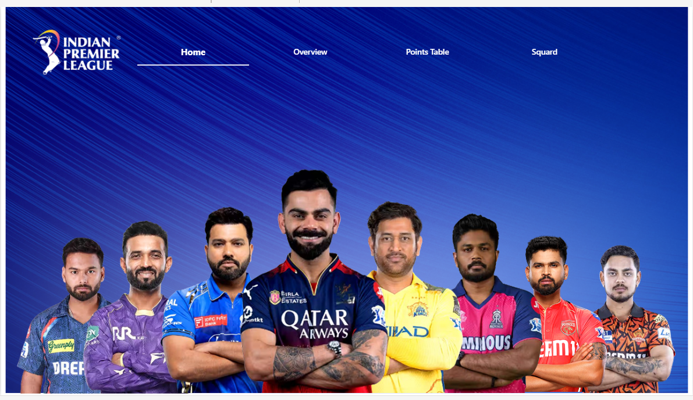
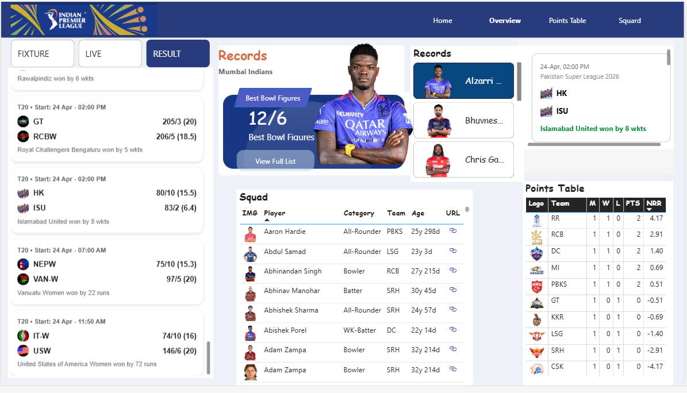
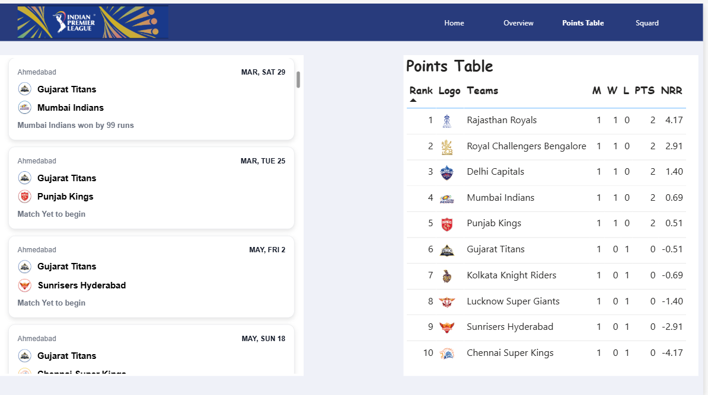
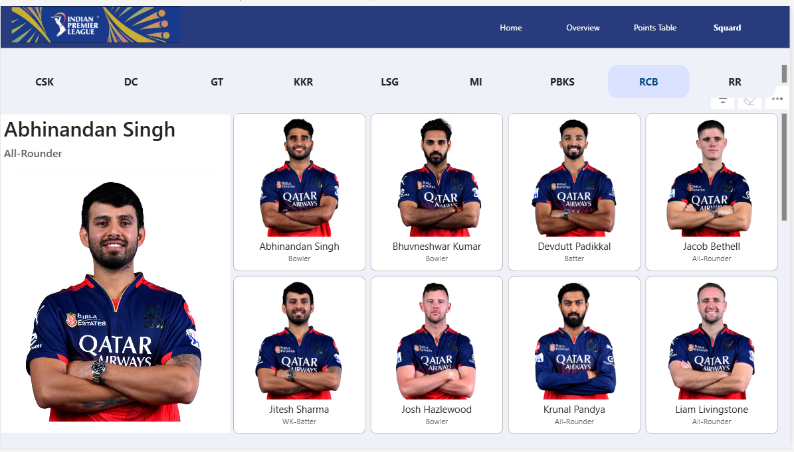
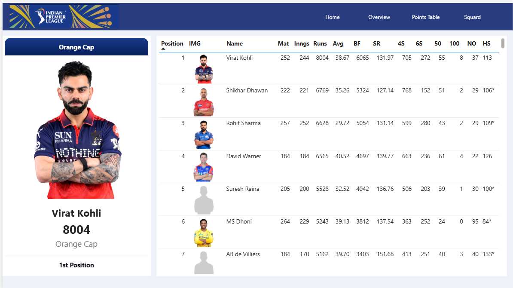
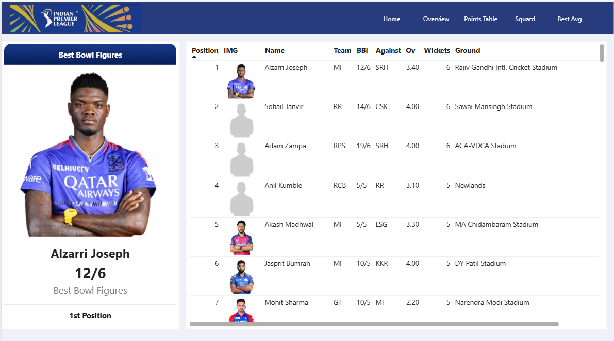

# 🏏 IPL Power BI Dashboard

> A Cricbuzz/IPL-style interactive dashboard built in Power BI — combining real cricket data, custom HTML/CSS UI, and advanced DAX.


---

## 📌 Project Overview

This dashboard replicates the look and feel of the **official IPL website and Cricbuzz** — built entirely inside Power BI using HTML visuals, CSS Flexbox layouts, and dynamic DAX measures.

It covers everything from live match fixtures and team squads to individual player leaderboards like the Orange Cap, Purple Cap, Most Dots, and Best Bowling Figures.

---

## 💡 Motivation

I'm a cricket fan first — always have been. When I started learning Data Science and Analytics, I realised this is exactly where my passion and skills meet. I had previously built a Spotify Dashboard, but when IPL 2026 season launched right as I was completing my Power BI foundations, the timing was perfect. I wanted to build something that felt personal, not just a practice exercise.

> *"When your passion meets your interest, you go way ahead."*

---

## 🧩 Dashboard Pages

| Page | Description |
|---|---|
| **Home** | Hero banner with IPL players and navigation |
| **Overview** | Live fixtures (Fixture / Live / Result tabs), Records section, Squad table, Points Table summary |
| **Points Table** | Full standings with M, W, L, PTS, NRR — left panel shows match schedule |
| **Squad** | Team-wise player cards (CSK, DC, GT, KKR, LSG, MI, PBKS, RCB, RR) with role labels |
| **Orange Cap** | Most runs leaderboard with player stats (Mat, Inns, Runs, Avg, SR, 4s, 6s, 50s, 100s, HS) |
| **Most Dots** | Top bowlers by dot balls with ECO and SR |
| **Best Bowl Figures** | Best single-match bowling performances (BBI, Against, Overs, Wickets, Ground) |
| *...and more* | Most Wickets, Purple Cap, and other hidden stat pages |

---

## 🎨 Custom UI Highlights

The biggest differentiator of this project is the **HTML + CSS visual** used inside Power BI:

- **Match cards** — styled like IPL/Cricbuzz fixture cards with team logos, scores, and venue
- **Player highlight cards** — Orange Cap / Purple Cap style with dynamic player data
- **Squad grid** — IPL-style player cards with role badges
- **Fixture list** — left-panel scrollable list with date grouping
- All layouts built using **CSS Flexbox** injected dynamically via **DAX measures**

---

## ⚙️ Technical Stack

### DAX Functions Used
- `SELECTEDVALUE()` — single filter context values
- `CONCATENATEX()` — generating HTML lists from multiple rows
- `LOOKUPVALUE()` — cross-table data fetching
- `SWITCH()` — dynamic logic (e.g., image selection based on category)
- Row context vs. filter context management across relationships

### HTML + CSS in Power BI
- Fully styled UI components written inside DAX measures
- Dynamic content injection — player names, stats, images all driven by DAX
- Solved **CORS image-loading** using `images.weserv.nl` proxy for external player images

---

## 📂 Data Sources & Collection

Getting the data was the hardest part of this project.

| Data Type | Source | Method |
|---|---|---|
| Live match data (fixtures, results) | External API | API integration |
| Most Runs, Most Wickets, Most Dots | IPL official website | Manual extraction → Excel |
| Best Bowling Figures | IPL official website | Manual extraction → Excel |
| Squad data (all 10 teams) | IPL official website | Manual extraction → Excel |
| Points Table | IPL official website | Manual extraction → Excel |

---

## 🔧 Data Cleaning & Transformation (The Hardest Part)

**~7–8 days out of 25 total days** were spent purely on data cleaning.

**Problems faced:**
- Raw column names like `ng-binding1`, `ng-binding2` (scraped API fields)
- Inconsistent team names across tables — `"Bangalore"` vs `"Bengaluru"` causing merge errors
- Missing values and null rows
- No direct keys between multiple tables — required custom mapping columns
- Date fields stored as text strings (e.g., `"MAR, SAT 22"`) — handled as text to avoid DAX conversion errors

**What was done:**
- Renamed every column across all tables manually
- Standardised team names across all datasets
- Cleaned and removed null/irrelevant rows
- Built relationship maps manually between tables
- Validated data against the IPL official website

---

## ⚠️ Challenges Faced

- **Data availability** — no single clean IPL dataset exists publicly
- **Data cleaning** — the longest and most patience-testing phase
- **Image loading in Power BI** — external images blocked by CORS; fixed using an image proxy
- **Multi-table relationships** — joining tables without shared primary keys
- **Lost progress** — had to rebuild 2 full dashboard pages after forgetting to save the `.pbix` file

---

## 🧠 Key Learnings

- Real-world data is always messy — cleaning it is 60% of the work
- HTML + CSS inside Power BI is a powerful (and underused) combo for custom UI
- DAX filter context vs. row context is critical to get right
- Always save your Power BI file. Always.
- Patience is a technical skill

---

## ⏱️ Timeline

| Phase | Duration |
|---|---|
| Data collection | ~3–4 days |
| Data cleaning & transformation | ~7–8 days |
| Dashboard design & DAX | ~10 days |
| UI polish & fixes | ~3–4 days |
| **Total** | **~25 days** |

---

## 🚀 Future Improvements

- Full live API integration for real-time match updates
- Player performance trend charts and advanced analytics
- Mobile-responsive layout
- Animations and smoother UI transitions

---

## 📸 Screenshots

| Home | Overview |
|---|---|
|  |  |

| Points Table | Squad |
|---|---|
|  |  |

| Orange Cap (Most Runs) | Best Bowling Figures |
|---|---|
|  |  |

---

## 📁 Project Structure

```
IPL-PowerBI-Dashboard/
├── IPL_Dashboard.pbix
├── README.md
└── images/
    ├── Home.png
    ├── Overview.png
    ├── points_table.png
    ├── Squards.png
    ├── Most_Runs.png
    ├── Most_Dots.png
    └── Best_bowl_fig.png
```

---

## 👨‍💻 About

Built by **Prince** — B.Tech CSE student at SKIT, Jaipur. Cricket fan. Data enthusiast. Previously built a Spotify Analytics Dashboard.

> This is where cricket and data science collide. 🏏📊
